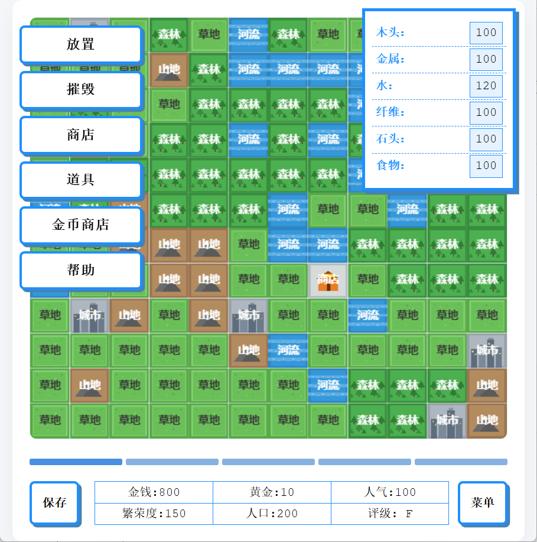

# 市长与商店物语
#### Mayer And Shop Story _(A Mini Simulation Game)_
#### v0.0.1
### 介绍(Introduction)
* **还在做，没做完。WIP**
* 这是一个**模拟经营游戏**，没有使用任何框架，**纯TS/JS实现，故很粗糙简陋，纯瞎折腾，闲的**。 
* 类开罗风格模拟经营游戏
* 玩法很简单，同时经营一个大地图（市长）的同时经营一个商店，需要合理控制城市的发展以及商店的经营，赚取更多的资金，将评分达到S级，不过该游戏**没有结局**，可以一直玩下去
* 玩家有多种属性值，资源，钱，黄金，人气，繁荣度，人口，这些属性都会影响商店的方方面面。
### 怎么玩(How to play)
release里下载MSS.html，然后直接用浏览器打开即可
### 截图(Screenshots)

### 日志(Changelog)
现在这个应该没什么可玩性，还有好多想法没做。